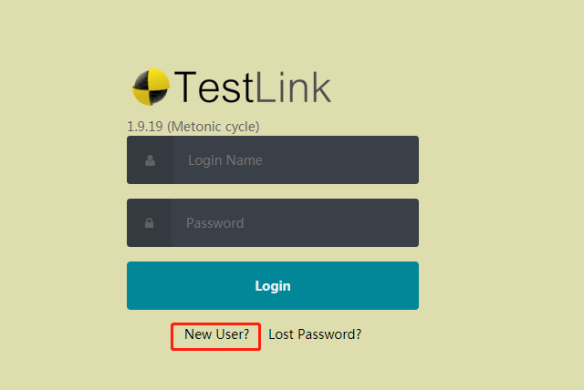
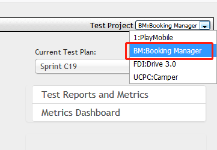
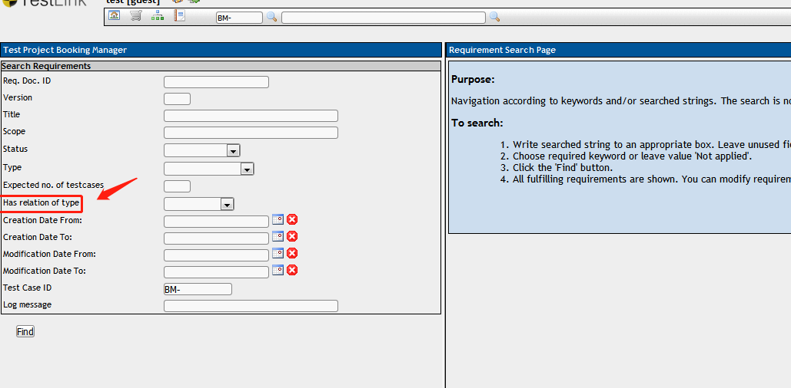
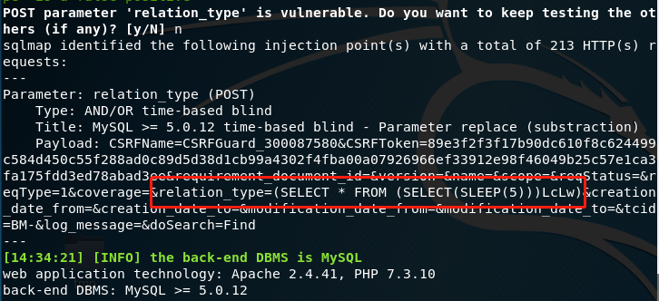

# testlink_SQLi
version 1.9.19

url:/testlink/lib/requirements/reqSearch.php

parameter:relation_type

### only needs guest privilege
1.regist

2.choose Test Project as BM：

3.Search Requirement

4.attack results

